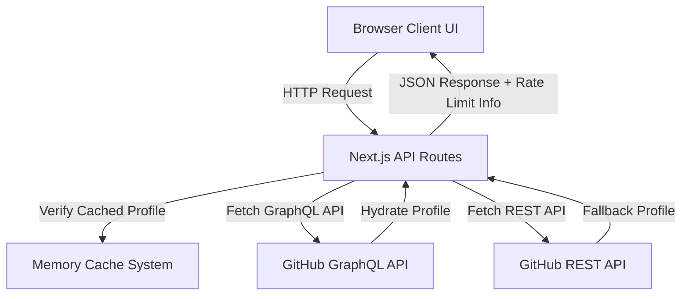

# Architecture Overview - GitHub User Analyzer

This document details the system design, file structure, and technical components of the GitHub User Analyzer.

## Architecture Diagram

## System Breakdown

### 1. Client-Side Pages (`/pages`)

- [index.tsx](file:///c:/Users/babin/Desktop/ELUSoC_2026/Github-User-Analyser/pages/index.tsx): Handles profile compare lookups and initial input.
- [[username].tsx](file:///c:/Users/babin/Desktop/ELUSoC_2026/Github-User-Analyser/pages/%5Busername%5D.tsx): Renders the main dashboard for a given user. Utilizes `getServerSideProps` to extract SEO tags for crawler bots dynamically.

### 2. Next.js API Layer (`/pages/api`)

- `github.ts`: Serves as a gateway, executing GraphQL requests when a `GITHUB_TOKEN` is found, else calling REST as a fallback.
- `ai-insight.ts`: Combines profile summaries and asks Google Gemini to provide tips (or mock fallbacks).
- `readme.ts`: Fetches and extracts repository Markdown descriptions.
- `badge/` & `export/`: Auto-generates badges and formats CSV/PDF downloads.

### 3. State & Caching (`/lib`)

- [cache.ts](file:///c:/Users/babin/Desktop/ELUSoC_2026/Github-User-Analyser/lib/cache.ts): Prevents duplicate remote queries by caching profile details in-memory for 5 minutes.
- [repoStats.ts](file:///c:/Users/babin/Desktop/ELUSoC_2026/Github-User-Analyser/lib/repoStats.ts): Computes language byte distributions and counts.
- [contributionStats.ts](file:///c:/Users/babin/Desktop/ELUSoC_2026/Github-User-Analyser/lib/contributionStats.ts): Formulates commits, streaks, and productivity parameters.
